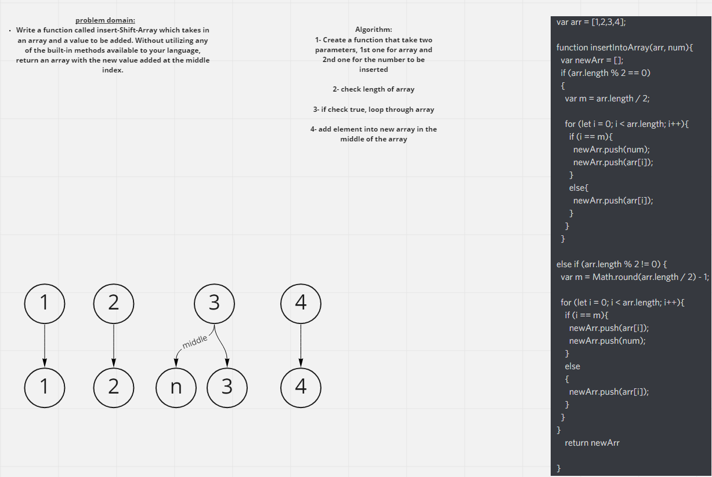

# Insert to Middle of an Array
Write a function called insertShiftArray which takes in an array and a value to be added. Without utilizing any of the built-in methods available to your language, return an array with the new value added at the middle index.

## Whiteboard Process

## Approach & Efficiency
i used 2 if statements to check if array is even or add then did the coding to add to the middle of the array. for the **big O**, for (let i = 0; i < arr.length; i++) **O(N)**

