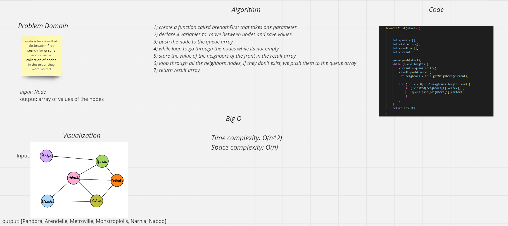
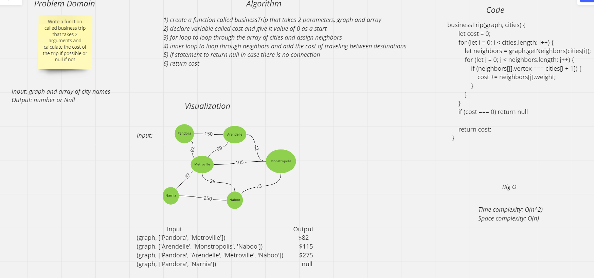
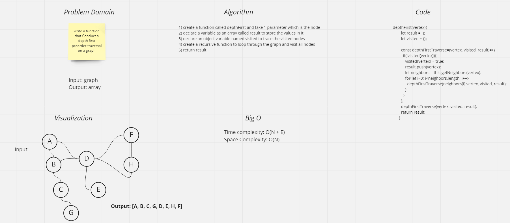

# Graphs
A graph data structure consists of a finite (and possibly mutable) set of vertices (also called nodes or points), together with a set of unordered pairs of these vertices for an undirected graph or a set of ordered pairs for a directed graph

## Challenge
Implement your own Graph. The graph should be represented as an adjacency list, and should include the following methods:

1. addNode
2. addEdge
3. getNodes
4. getNeighbors
5. size
6. breadthFirst
7. businessTrip
8. depthFirst

## breadthFirst Whiteboard

## businessTrip Whiteboard

## depthFirst Whiteboard

## Approach & Efficiency
1. addNode:  `Time and space complexity: O(1)` because we are just adding and there is no looping or anything.

2. addEdge: `Time complexity of O(n)` because we are looping through the list of nodes and adding the edge to each node and for `space complexity its just O(1)` because we just create constant number and not related to looping.

3. getNodes: `Time complexity of O(n)` because we are looping through the list of nodes and for `space complexity its O(n)` because we just adding all of them to an array and then returning it.

4. getNeighbors: `Time complexity of O(n)` because we are looping through the list of nodes and for `space complexity its O(1)` because we just returning the neighbors.

5. size: `Time complexity is O(N)` where N is the size of the list. `Space complexity is O(1)` because we just create one space.

6. breadthFirst: `Time complexity is O(N^2)` because we have for loop inside while loop and `Space complexity is O(n)`.

7. businessTrip: `Time complexity is O(N^2)` because we have nested loop and `Space complexity is O(n)`.

8. depthFirst: `Time complexity: O(N + E)`, where N is the number of vertices and E is the number of edges in the graph and `space Complexity: O(n)`, since an extra visited array of size n is required.
