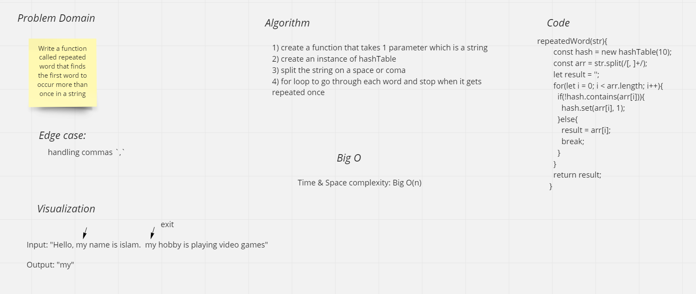

# Challenge Summary
Write a function called repeated word that finds the first word to occur more than once in a string

## Whiteboard Process

## Approach & Efficiency

Optimized Approach:

Instead of counting a number of occurrences of each word which will have `O(N) time and space complexity`, where N is number of words, we can stop when the count of any word becomes 2. That is no need to iterate through all the words in string.

## Solution
`npm test hash`