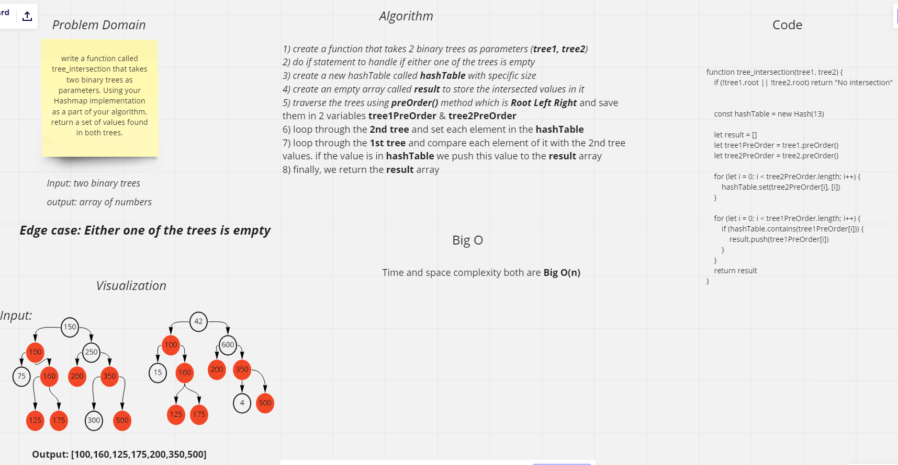

# Challenge Summary
The challange asked us to write a function called tree_intersection that takes two binary trees as parameters. Using your Hashmap implementation as a part of your algorithm, return a set of values found in both trees.

## Whiteboard Process

## Approach & Efficiency
i used for loop to iterate through the array and check if the value is present in the hash table.

* BigO Time complexity : O(n) That's big O(2n) which is `Big O(n)` while iterating two times through two different arrays.

* BigO Space complexity : `big O(n)` because created a space that depens on the size of the second array input so it will be o(n);

## Solution
 
 `npm test tree-intersection`