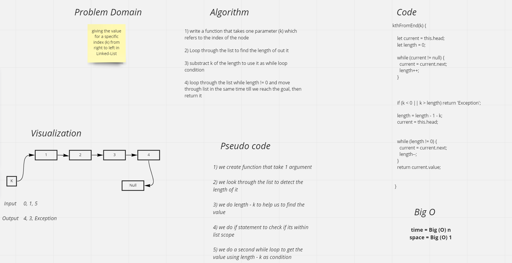
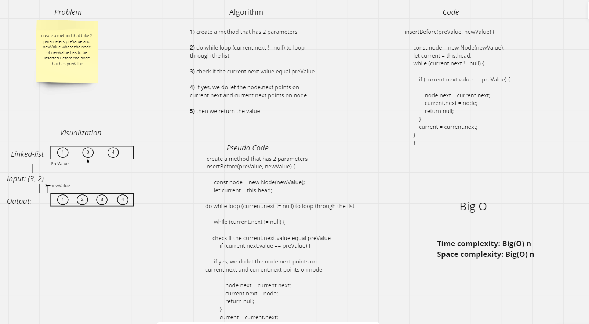
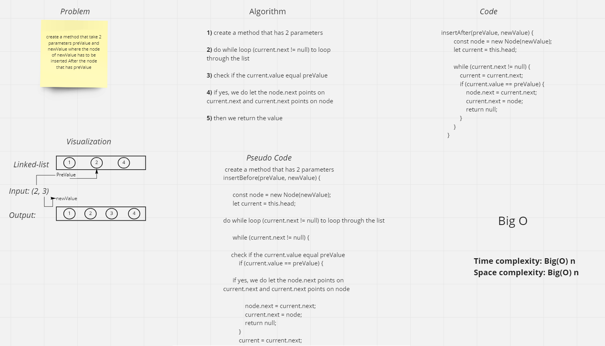

# Singly Linked List
A linked list is typically used for collecting sequences of objects requiring the need for efficient addition and removal of elements from the middle of the sequence.

## Challenge
Create a Linked List class
Within your Linked List class, include a head property.
Upon instantiation, an empty Linked List should be created.
also 3 methods that are insert, includes, and toString

## kthFromEnd method
the challange asked us
to ask give the output of a specific index from the right to the left of the linked list

kthFromEnd ----> time = Big(O) n

**Space - O(1)** for kthFromEnd

## addBefore method
the challange asked us
to create a method that take 2 parameters preValue and newValue where the node of newValue has to be inserted **Before** the node that has preValue.

## addAfter method
the challange asked us
to create a method that take 2 parameters preValue and newValue where the node of newValue has to be inserted **After** the node that has preValue.

So if you want to add a new node to a LinkedList, first you have to traverse it to find the "right" position where to insert the new element (a O(n) operation), then you have to insert it by using `AddBefore` or `AddAfter` (a O(1) operation). The composite complexity is clearly O(n).

## Approach & Efficiency
while loop because this kind of loop does't have starting and ending values so it will be flixable with the condition untill the condition is fail. insert --> BigO O(1). include --> BigO O(n). toString --> BigO O(n). append --> BigO O(1). addBefore --> BigO O(n). addAfter --> BigO O(n).

Linked lists hold two main pieces of information (the value and pointer) per node. This means that the amount of data stored increases linearly with the number of nodes in the list. Therefore, the space complexity of the linked list is linear:

**Space - O(n)** for all of them
