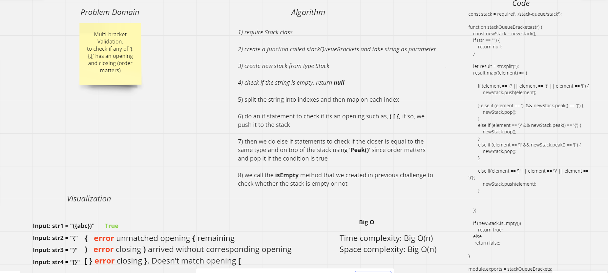

# Challenge Summary
The challange asked us to check if the string has a full bracket or only a part of it. if it has a full one it will return true else will return false.

# Whiteboard

## Approach & Efficiency
* BigO time ---> O(n) because it depends on the length of the string and we will loop through all of it 
* BigO space---> O(n) because it depends on the length of the string

## Solution
stack-queue-brackets.test.js