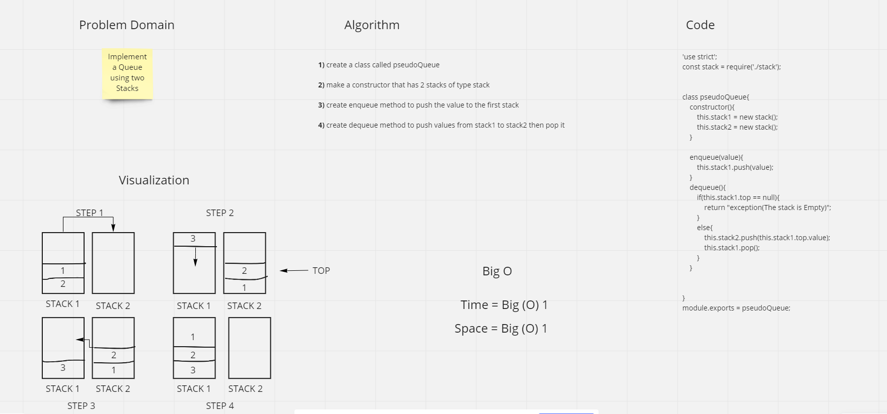

# Challenge Summary
The challange asked us to enqueue and dequeue a stack as a queue.

## Whiteboard Process

## Approach & Efficiency
we used the same method from previous challenge and same process so the time and complexity will remain the same which is **big O (1)**

* enqueue BigO ---> o(1);
* dequeue BigO ---> o(1);

## Solution

*stack-queue.test.js*
