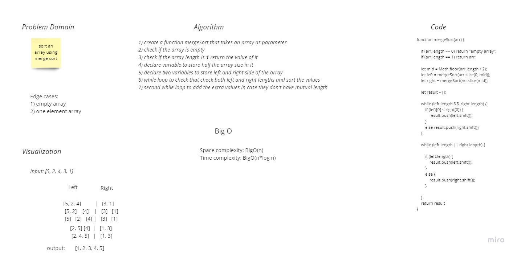

# Challenge Summary
challenge asked us to create a function that use insertion sort to sort an array of numbers.

## Whiteboard Process

## Approach & Efficiency
`Time complexity`  **O(nLogn)** (and average-case) The list of size N is divided into a max of Logn parts, and the merging of all sublists into a single list takes O(N) time.

`Space complexity` is always O(n) as we have to store the elements somewhere. Additional space complexity can be O(n)

## Solution
`npm test merge`