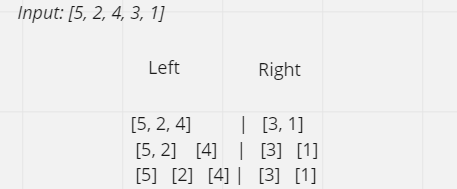
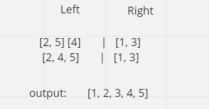

# merge sort
The MergeSort function repeatedly divides the array into two halves until we reach a stage where we try to perform MergeSort on a subarray of size 1 i.e.

 ## Pseudocode
    ALGORITHM Mergesort(arr)
    DECLARE n <-- arr.length

    if n > 1
      DECLARE mid <-- n/2
      DECLARE left <-- arr[0...mid]
      DECLARE right <-- arr[mid...n]
      // sort the left side
      Mergesort(left)
      // sort the right side
      Mergesort(right)
      // merge the sorted left and right sides together
      Merge(left, right, arr)

    ALGORITHM Merge(left, right, arr)
    DECLARE i <-- 0
    DECLARE j <-- 0
    DECLARE k <-- 0

    while i < left.length && j < right.length
        if left[i] <= right[j]
            arr[k] <-- left[i]
            i <-- i + 1
        else
            arr[k] <-- right[j]
            j <-- j + 1

        k <-- k + 1

    if i = left.length
       set remaining entries in arr to remaining values in right
    else
       set remaining entries in arr to remaining values in left

  ## Trace

### Sample Array: [5, 2, 4, 3, 1]

### step 1: 
        the array is split into two halves, left and right.
        then we store them in two variables, left and right.
        this is repeated until all the elements are split indivdually.

     

    
### step 2:
        sort the left and right sides then merge them together to one sorted array.

# Efficency

`Time complexity`  **O(nLogn)** (and average-case) The list of size N is divided into a max of Logn parts, and the merging of all sublists into a single list takes O(N) time.

`Space complexity` is always O(n) as we have to store the elements somewhere. Additional space complexity can be O(n)