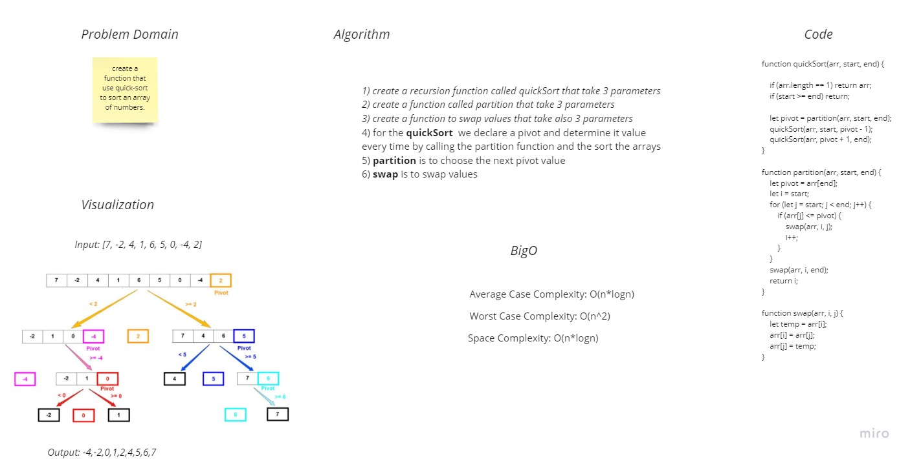

# Challenge Summary
challenge asked us to create a function that use quick-sort to sort an array of numbers.

## Whiteboard Process

## Approach & Efficiency
`Time complexity` (Average / best) **O(nLogn)** It occurs when the array elements are in jumbled order that is not properly ascending and not properly descending.

`Time complexity` (worst case) In quick sort, worst case occurs when the pivot element is either greatest or smallest element. Suppose, if the pivot element is always the last element of the array, the worst case would occur when the given array is sorted already in ascending or descending order. The worst-case time complexity of quicksort is **O(n^2)**.

`Space complexity` The average case space used will be **O(log n)**. The worst case space complexity becomes **O(n)**, when the algorithm encounters its worst case where for getting a sorted list, we need to make n recursive calls.

## Solution
`npm test quickSort`