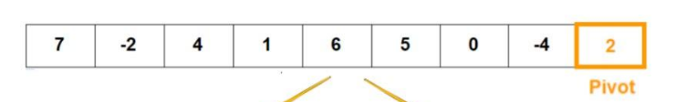
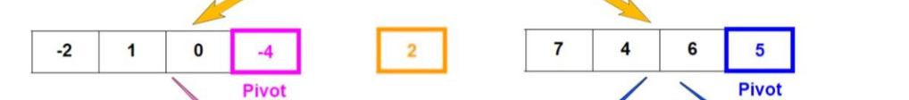
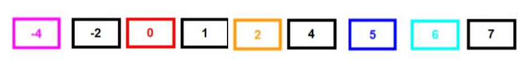

# Quick sort
Quicksort uses the divide-and-conquer strategy to sort the given list of elements. This means that the algorithm breaks down the problem into subproblems until they become simple enough to solve directly.

 ## Pseudocode
    ALGORITHM QuickSort(arr, left, right)
    if left < right
        // Partition the array by setting the position of the pivot value
        DEFINE position <-- Partition(arr, left, right)
        // Sort the left
        QuickSort(arr, left, position - 1)
        // Sort the right
        QuickSort(arr, position + 1, right)

    ALGORITHM Partition(arr, left, right)
    // set a pivot value as a point of reference
    DEFINE pivot <-- arr[right]
    // create a variable to track the largest index of numbers lower than the defined pivot
    DEFINE low <-- left - 1
    for i <- left to right do
        if arr[i] <= pivot
            low++
            Swap(arr, i, low)

     // place the value of the pivot location in the middle.
     // all numbers smaller than the pivot are on the left, larger on the right.
     Swap(arr, right, low + 1)
    // return the pivot index point
     return low + 1

    ALGORITHM Swap(arr, i, low)
    DEFINE temp;
    temp <-- arr[i]
    arr[i] <-- arr[low]
    arr[low] <-- temp

# Trace

### Sample Array: [7, -2, 4, 1, 6, 5, 0, -4, 2]

## step 1:
The first thing we do is choosing the last element to be the pivot.

## step 2:
Now we split the array to 2 parts, smaller and bigger than pivot. now loop through the array and check if the value of the index is less or bigger than the pivot and repeat.

## step 3:
As the last step, we swap the pivot, which is the last element in our case, with the pivotIndex. So, in the end, our pivot element would end up in the "middle." With all elements less than the pivot to the left side of it, and all elements greater than or equal to the pivot to the right of the pivot.

# Efficency

`Time complexity` (Average / best) **O(nLogn)** It occurs when the array elements are in jumbled order that is not properly ascending and not properly descending.

`Time complexity` (worst case) In quick sort, worst case occurs when the pivot element is either greatest or smallest element. Suppose, if the pivot element is always the last element of the array, the worst case would occur when the given array is sorted already in ascending or descending order. The worst-case time complexity of quicksort is **O(n^2)**.

`Space complexity` The average case space used will be **O(log n)**. The worst case space complexity becomes **O(n)**, when the algorithm encounters its worst case where for getting a sorted list, we need to make n recursive calls.

    

