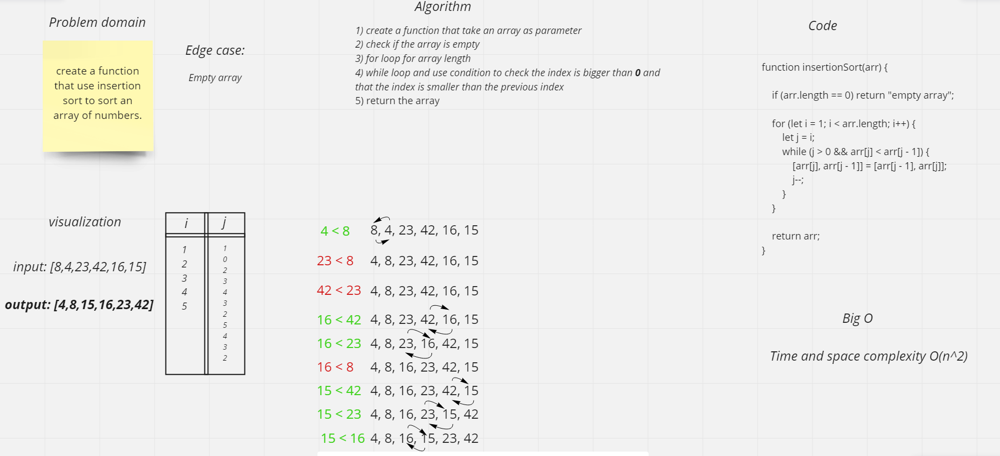

# Challenge Summary
challenge asked us to create a function that use insertion sort to sort an array of numbers.

## Whiteboard Process

## Approach & Efficiency
`The worst-case` (and average-case) complexity of the insertion sort algorithm is `bigO(n²)` because the time taken to sort a list is proportional to the square of the number of elements in the list.

`The best-case` time complexity of insertion sort algorithm is `bigO(n)` time complexity. because the time taken to sort a list is proportional to the number of elements in the list.

## Solution
`npm test insertion`