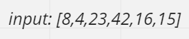
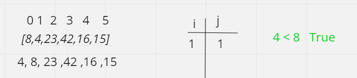
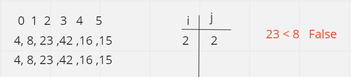
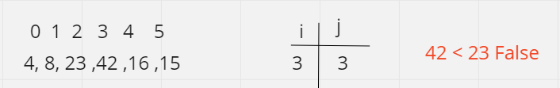
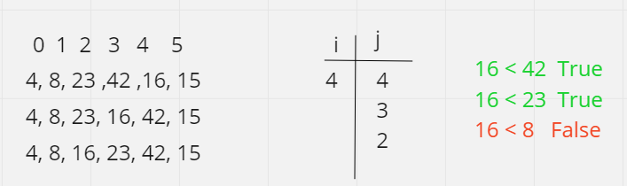
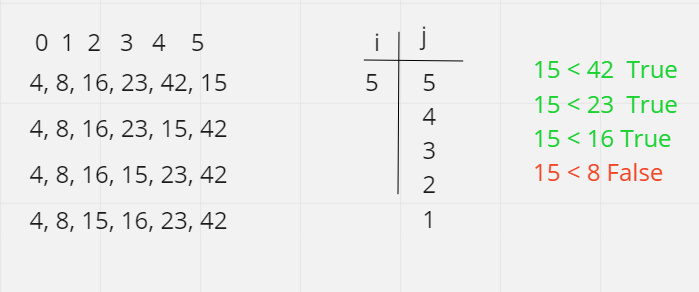
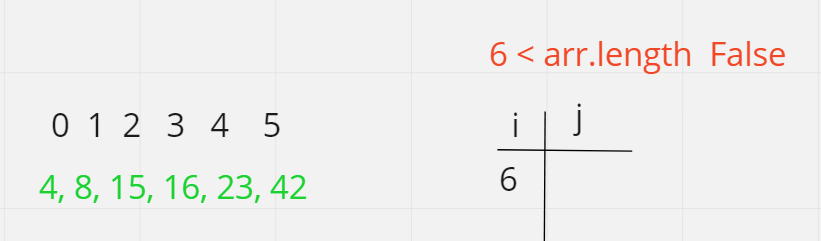

# Pseudocode
  InsertionSort(int[] arr)

    FOR i = 1 to arr.length

      int j <-- i - 1
      int temp <-- arr[i]

      WHILE j >= 0 AND temp < arr[j]
        arr[j + 1] <-- arr[j]
        j <-- j - 1

      arr[j + 1] <-- temp

# Trace

## first we check if the array is empty
if condition is true we return Empty array

## next step compare index 1 with index 0
condition true we swap values

## next step index 2 with index 1
condition false we don't swap values

## next step index 3 with index 2
condition false we don't swap values

## next step index 4 with 3, 2, and 1
condition true we swap values

## next step index 5 with index 4, 3, and 2
condition true we swap values

## last step exit loop

condition false we exit loop

## Efficency
Time: O(n^2) The basic operation of this algorithm is comparison. This will happen n * (n-1) times.

Space: O(1) No additional space is being created.