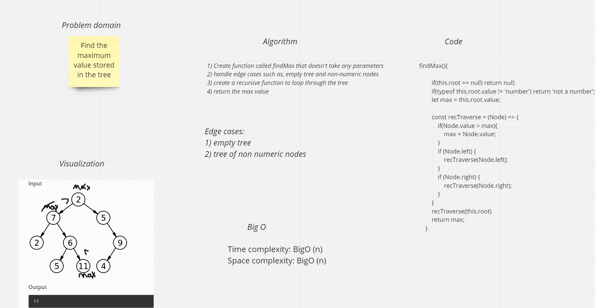

# Trees
Tree is a data structure that has many types Binary tree (k = 2) , binary search trees(left values are lesser than the root value,the right values are greater than the root value) and K-ary trees(k > 2).

## Challenge
The challenge asked us to create a method to Find the maximum value stored in the tree

## Approach & Efficiency
i used recursion for the findMax method to loop through it.

## whiteboard

### **Time complexity**
In the recursive function calls, every node of the tree is processed once and the complexity due to the function is O(N).

### **Space complexity**

Recursive call is happening. The every node is processed once and considering the array space, the space complexity will be O(N).
